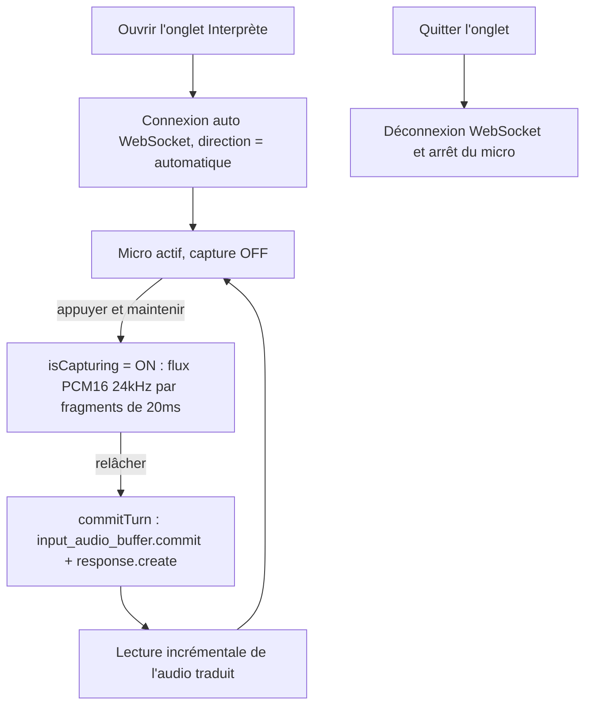

# Nekko Live Interpreter

> [English](./README.md) | [日本語](./README.ja.md)

Une application iOS qui transforme votre iPhone en **interprète vocal en temps réel** entre le japonais et l'anglais, propulsée entièrement par l'**API Realtime d'OpenAI**. Maintenez un bouton, parlez, et un mignon chat en pixel art nommé **Nekko** vous restitue la traduction dès que vous relâchez.

## Pourquoi c'est instantané

La plupart des applications d'interprétation enchaînent trois modèles (reconnaissance vocale → traduction LLM → synthèse vocale). Nekko utilise un seul modèle **voix-à-voix** sur une connexion persistante, sans aller-retour textuel intermédiaire :

- **Un seul modèle voix-à-voix** (`gpt-realtime`) — audio en entrée, audio en sortie, sans étapes STT/TTS intermédiaires.
- **WebSocket persistant** — la connexion est ouverte une seule fois à l'ouverture de l'onglet, sans surcoût de connexion par requête.
- **Diffusion par fragments de 20 ms** — pendant que vous maintenez le bouton, l'audio est envoyé par fragments de 20 ms ; au moment où vous relâchez, le serveur possède déjà presque toute votre parole.
- **Lecture incrémentale** — l'audio traduit est joué à mesure que chaque `response.output_audio.delta` arrive, sans attendre la fin de la réponse.
- **Push-to-Talk** — relâcher le bouton valide manuellement le tour de parole, donc le modèle n'attend jamais de détecter un silence avant de répondre.

## Fonctionnement



## Utilisation d'OpenAI

| Aspect | Détail |
|--------|--------|
| API | API Realtime d'OpenAI via WebSocket |
| Endpoint | `wss://api.openai.com/v1/realtime` |
| Modèle | `gpt-realtime` (repli `gpt-4o-realtime-preview`) |
| Voix | `coral` (repli auto : `shimmer` → `marin` → `cedar` → `alloy`) |
| Entrée audio | PCM16 mono 24 kHz, envoyé par fragments de 20 ms via `input_audio_buffer.append` |
| Sortie audio | PCM16 mono 24 kHz, lue de façon incrémentale depuis `response.output_audio.delta` |
| Transcription d'entrée | `whisper-1` |
| Forme de session | Forme GA : `type: "realtime"`, `output_modalities: ["audio"]`, `audio.input/output` |
| Gestion des tours | Push-to-Talk : `turn_detection` omis ; `input_audio_buffer.commit` + `response.create` manuels au relâchement |

Tous les appels API sont effectués **directement depuis l'application iOS** vers `api.openai.com`. Aucun serveur backend n'est nécessaire.

## Conception Push-to-Talk

L'application est optimisée pour les environnements bruyants de démo et de questions-réponses :

- **Tours manuels** — par défaut, `turn_detection` est omis de la session. L'audio n'est capturé que pendant que le bouton est maintenu, et le tour est validé dès le relâchement. Cela évite de capter les conversations ambiantes et supprime toute attente de détection de silence côté serveur. Si un modèle rejette la forme sans `turn_detection`, l'application bascule automatiquement sur `server_vad` (silence de 1500 ms).
- **Invite « traducteur uniquement »** — les instructions système imposent un traducteur strict à sens unique. Même des phrases comme « traduis ceci » ou « tu m'entends ? » sont traduites littéralement au lieu d'être traitées comme une conversation.
- **Personnalité de chat** — l'invite demande une voix enjouée, enfantine et légèrement plus aiguë, avec une touche féline (un doux `ニャ` / `meow`) sans changer le sens.

## Architecture

```
iOS App (Nekko)
    ├── À l'ouverture de l'onglet : connexion auto WebSocket → OpenAI Realtime (gpt-realtime)
    ├── Capture micro : AVAudioEngine → PCM16 mono 24kHz (S16LE), fragments de 20ms
    ├── Maintenir pour parler : flux audio ; relâcher → commit + response.create
    ├── Lecture : response.output_audio.delta → AVAudioEngine (incrémentale)
    └── Données : UserDefaults (clé API)
```

- **La direction** est fixée sur `automatique` : le japonais est traduit en anglais, l'anglais en japonais.
- **Sans backend** : l'application communique directement avec l'API Realtime d'OpenAI.

## Stack technique

| Technologie | Utilisation |
|-------------|-------------|
| SwiftUI | Interface utilisateur |
| AVAudioEngine | Capture micro et lecture audio |
| AVAudioConverter | Rééchantillonnage en PCM16 mono 24 kHz |
| URLSessionWebSocketTask | Connexion OpenAI Realtime |
| API Realtime d'OpenAI (`gpt-realtime`) | Interprétation voix-à-voix en direct |
| SwiftData | Persistance locale pour l'onglet Enregistrements (hérité) |
| WidgetKit | Widget chat en pixel art |

## Installation

### 1. Application iOS

1. Ouvrir `Nekko.xcodeproj` dans Xcode.
2. Configurer votre équipe dans Signing & Capabilities.
3. Exécuter sur un iPhone (appareil ou simulateur).

### 2. Clé API OpenAI

1. Obtenir une clé API sur [OpenAI Platform](https://platform.openai.com).
2. Dans l'application, ouvrir l'onglet **Réglages** → **OpenAI** → saisir votre **clé API OpenAI**.

La clé est stockée localement sur l'appareil (UserDefaults) et n'est utilisée que pour l'interprète en direct.

## Conseils pour la démo

1. Utilisez un casque pour éviter une boucle d'interprétation (le micro captant la sortie haut-parleur).
2. Ouvrez l'onglet **Interprète** — il se connecte automatiquement à OpenAI.
3. **Maintenez** le grand bouton pendant que vous parlez.
4. **Relâchez** — Nekko prononce la traduction dans l'autre langue.

## Contexte du projet

Nekko a débuté comme un enregistreur de réunions basé sur Mistral (enregistrement, transcription, synthèse). Pour l'**OpenAI Voice Hack Night**, l'expérience d'interprétation a été reconstruite sur l'API Realtime d'OpenAI (`gpt-realtime`) sous forme d'interprète voix-à-voix en push-to-talk avec une personnalité de chat.

## Traduction prise en charge

Japonais ↔ Anglais (détection automatique de la direction).

## Licence

Hackathon Project — OpenAI Voice Hack Night 2026
