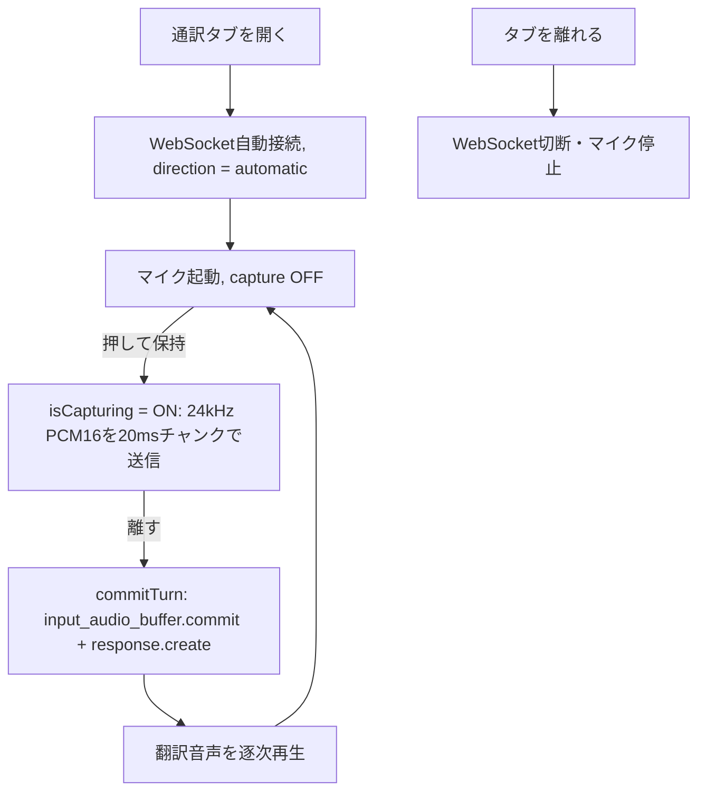

# Nekko Live Interpreter

> [English](./README.md)

**OpenAI Realtime API** を活用した、猫のNekkoが日本語と英語を音声対音声で通訳してくれる iOS アプリ。ボタンを押している間だけ話し、離した瞬間にNekkoが可愛い猫らしい声でもう一方の言語へ通訳します。

## なぜ速いのか

一般的な通訳アプリは3つのモデル（音声認識 → LLM翻訳 → 音声合成）を連結しますが、Nekkoは常時接続の上で**音声から音声へ**の単一モデルを使うため、途中のテキスト往復がありません。

- **音声→音声の単一モデル**（`gpt-realtime`）— 音声を入れて音声で返す。中間のSTT/TTSなし。
- **常時接続のWebSocket** — タブを開いた時に1回だけ接続。リクエストごとの接続オーバーヘッドなし。
- **20msストリーミング** — 押している間、音声を20msチャンクで送り続けるので、離した時点でサーバーはほぼ全音声を保持済み。
- **逐次再生** — 翻訳音声は `response.output_audio.delta` が届くたびに即再生（全体の完成を待たない）。
- **Push-to-Talk** — 離した瞬間に手動でターンを確定するので、無音検知の待ち時間がゼロ。

## 動作の流れ



## OpenAI の利用箇所

| 項目 | 内容 |
|------|------|
| API | OpenAI Realtime API（WebSocket） |
| エンドポイント | `wss://api.openai.com/v1/realtime` |
| モデル | `gpt-realtime`（フォールバック `gpt-4o-realtime-preview`） |
| 音声 | `coral`（自動フォールバック: `shimmer` → `marin` → `cedar` → `alloy`） |
| 音声入力 | 24kHz mono PCM16、20msチャンクで `input_audio_buffer.append` |
| 音声出力 | 24kHz mono PCM16、`response.output_audio.delta` を逐次再生 |
| 入力文字起こし | `whisper-1` |
| セッション形式 | GA shape: `type: "realtime"`, `output_modalities: ["audio"]`, `audio.input/output` |
| ターン制御 | Push-to-Talk: `turn_detection` を省略し、離した瞬間に手動 `input_audio_buffer.commit` + `response.create` |

API 呼び出しは iOS アプリから OpenAI Realtime API に**直接接続**します。バックエンドサーバーは不要です。

## Push-to-Talk 設計

騒がしいデモ・Q&A環境向けにチューニングしています。

- **手動ターン** — 既定では `turn_detection` をセッションから省略。ボタンを押している間だけ音声を取り込み、離した瞬間にターンを確定します。これにより周囲の会話を拾わず、サーバー側の無音検知待ちもゼロになります。モデルが省略形を拒否した場合は自動的に `server_vad`（無音1500ms）にフォールバックします。
- **通訳専用プロンプト** — system instructions で「一方向の通訳機」を強制。「翻訳して」「聞こえますか？」のような発話も会話として応答せず、そのまま訳します。
- **猫キャラクター** — 子どもっぽく弾むような、少し高めの声と、意味を変えない範囲の軽い猫らしさ（柔らかい `ニャ` / `meow`）を指示しています。

## アーキテクチャ

```
iOS App (Nekko)
    ├── タブ表示時: WebSocket自動接続 → OpenAI Realtime (gpt-realtime)
    ├── マイク取得: AVAudioEngine → 24kHz mono PCM16 (S16LE), 20msチャンク
    ├── 押して話す: 音声送信; 離す → commit + response.create
    ├── 再生: response.output_audio.delta → AVAudioEngine（逐次）
    └── データ: UserDefaults（APIキー）
```

- **通訳方向**は `automatic` 固定: 日本語は英語へ、英語は日本語へ自動判定。
- **バックエンド不要**: アプリが OpenAI Realtime API と直接通信します。

## 使用技術

| 技術 | 用途 |
|------|------|
| SwiftUI | ユーザーインターフェース |
| AVAudioEngine | マイク録音・音声再生 |
| AVAudioConverter | 24kHz mono PCM16 へのリサンプリング |
| URLSessionWebSocketTask | OpenAI Realtime 接続 |
| OpenAI Realtime API (`gpt-realtime`) | ライブ音声通訳 |
| SwiftData | 記録タブ（レガシー）のローカル永続化 |
| WidgetKit | ホーム画面のドット絵猫ウィジェット |

## セットアップ

### 1. iOS アプリ

1. `Nekko.xcodeproj` を Xcode で開く。
2. Signing & Capabilities でチームを設定。
3. iPhone 実機またはシミュレータで実行。

### 2. OpenAI API キー

1. [OpenAI Platform](https://platform.openai.com) で API キーを取得。
2. アプリ内の **設定** タブ → **OpenAI** → **OpenAI API キー** に入力。

API キーは端末内（UserDefaults）にのみ保存され、ライブ音声通訳に使用されます。

## デモ手順

1. ヘッドフォンを接続します（スピーカー音声をマイクが拾う通訳ループを避けるため）。
2. **通訳** タブを開きます（自動でOpenAIに接続）。
3. 大きなボタンを**押している間**に話します。
4. **離す**と、Nekkoがもう一方の言語で通訳音声を再生します。

## 対応通訳

日本語 ↔ English（方向は自動判定）

## ライセンス

Hackathon Project — OpenAI Voice Hack Night 2026
