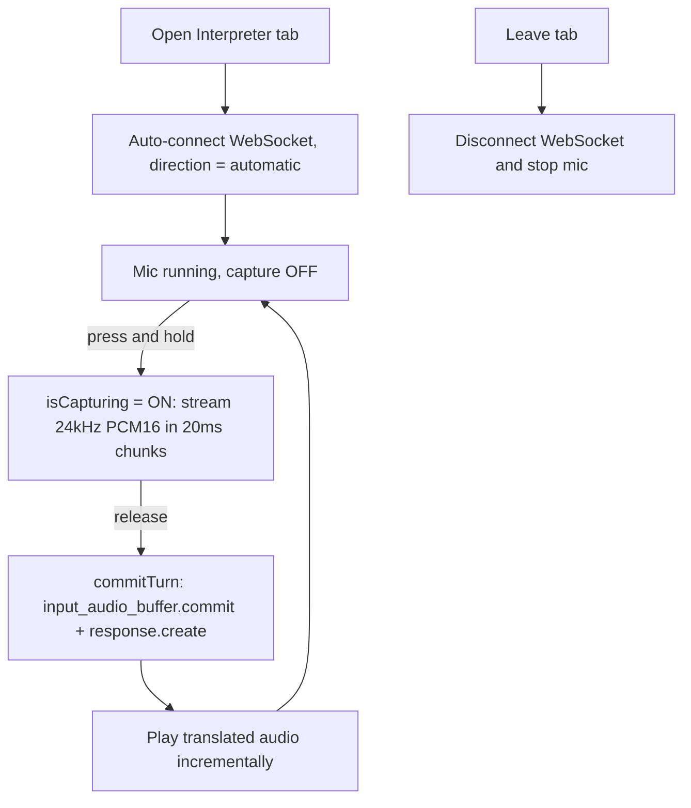

# Nekko Live Interpreter

An iOS app that turns your iPhone into a **real-time, voice-to-voice interpreter** between Japanese and English, powered entirely by the **OpenAI Realtime API**. Hold a button, speak, and a cute pixel-art cat named **Nekko** speaks the translation back to you the moment you release.

## Why it feels instant

Most interpreter apps chain three models together (Speech-to-Text → LLM translation → Text-to-Speech). Nekko uses a single **speech-to-speech** model over a persistent connection, so there is no text round-trip in the middle:

- **One speech-to-speech model** (`gpt-realtime`) — audio in, audio out, no intermediate STT/TTS hops.
- **Persistent WebSocket** — the connection is opened once when you open the tab; there is no per-request connection overhead.
- **20 ms streaming** — while you hold the button, audio is streamed in 20 ms chunks, so by the time you release, the server already has almost all of your speech.
- **Incremental playback** — translated audio is played as each `response.output_audio.delta` arrives, not after the whole response finishes.
- **Push-to-Talk** — releasing the button manually commits the turn, so the model never waits to detect silence before responding.

## How it works



## How OpenAI is used

| Aspect | Detail |
|--------|--------|
| API | OpenAI Realtime API over WebSocket |
| Endpoint | `wss://api.openai.com/v1/realtime` |
| Model | `gpt-realtime` (fallback `gpt-4o-realtime-preview`) |
| Voice | `coral` (auto-fallback: `shimmer` → `marin` → `cedar` → `alloy`) |
| Audio input | 24 kHz mono PCM16, streamed in 20 ms chunks via `input_audio_buffer.append` |
| Audio output | 24 kHz mono PCM16, played incrementally from `response.output_audio.delta` |
| Input transcription | `whisper-1` |
| Session shape | GA shape: `type: "realtime"`, `output_modalities: ["audio"]`, `audio.input/output` |
| Turn-taking | Push-to-Talk: `turn_detection` omitted; manual `input_audio_buffer.commit` + `response.create` on release |

All API calls are made **directly from the iOS app** to `api.openai.com`. No backend server is required.

## Push-to-Talk design

The app is tuned for noisy demo and Q&A environments:

- **Manual turns** — by default `turn_detection` is omitted from the session. Audio is only captured while the button is held, and the turn is committed the instant you release. This avoids picking up ambient conversation and removes any server-side silence-detection wait. If a model rejects the no-`turn_detection` shape, the app automatically falls back to `server_vad` (1500 ms silence).
- **Translator-only prompt** — the system instructions force a strict one-way translator. Even phrases like "translate this" or "can you hear me?" are translated literally instead of being answered conversationally.
- **Cat personality** — the prompt asks for a child-like, playful, slightly higher-pitched voice and a light cat-like flourish (a soft `ニャ` / `meow`) without changing meaning.

## Architecture

```
iOS App (Nekko)
    ├── On tab appear : auto-connect WebSocket → OpenAI Realtime (gpt-realtime)
    ├── Mic capture   : AVAudioEngine → 24kHz mono PCM16 (S16LE), 20ms chunks
    ├── Hold to talk  : stream audio; release → commit + response.create
    ├── Playback      : response.output_audio.delta → AVAudioEngine (incremental)
    └── Data          : UserDefaults (API key)
```

- **Direction** is fixed to `automatic`: Japanese is translated to English, English to Japanese.
- **No backend**: the app talks to the OpenAI Realtime API directly.

## Tech Stack

| Technology | Purpose |
|------------|---------|
| SwiftUI | User interface |
| AVAudioEngine | Microphone capture and audio playback |
| AVAudioConverter | Resampling to 24 kHz mono PCM16 |
| URLSessionWebSocketTask | OpenAI Realtime connection |
| OpenAI Realtime API (`gpt-realtime`) | Live speech-to-speech interpretation |
| SwiftData | Local persistence for the legacy Records tab |
| WidgetKit | Home screen pixel-art cat widget |

## Setup

### 1. iOS App

1. Open `Nekko.xcodeproj` in Xcode.
2. Configure your team under Signing & Capabilities.
3. Run on an iPhone (device or simulator).

### 2. OpenAI API Key

1. Obtain an API key from [OpenAI Platform](https://platform.openai.com).
2. In the app, open the **Settings** tab → **OpenAI** → enter your **OpenAI API Key**.

The key is stored locally on the device (UserDefaults) and is used only for the live interpreter.

## Demo tips

1. Use headphones to avoid an interpreter loop (the mic picking up the speaker output).
2. Open the **Interpreter** tab — it auto-connects to OpenAI.
3. **Press and hold** the big button while you speak.
4. **Release** — Nekko speaks the translation in the other language.

## Project background

Nekko started as a Mistral-based meeting recorder (recording, transcription, summarization). For the **OpenAI Voice Hack Night**, the interpreter experience was rebuilt on top of the OpenAI Realtime API (`gpt-realtime`) as a voice-to-voice, push-to-talk interpreter with a cat persona.

## Supported translation

Japanese ↔ English (automatic direction detection).

## License

Hackathon Project — OpenAI Voice Hack Night 2026
